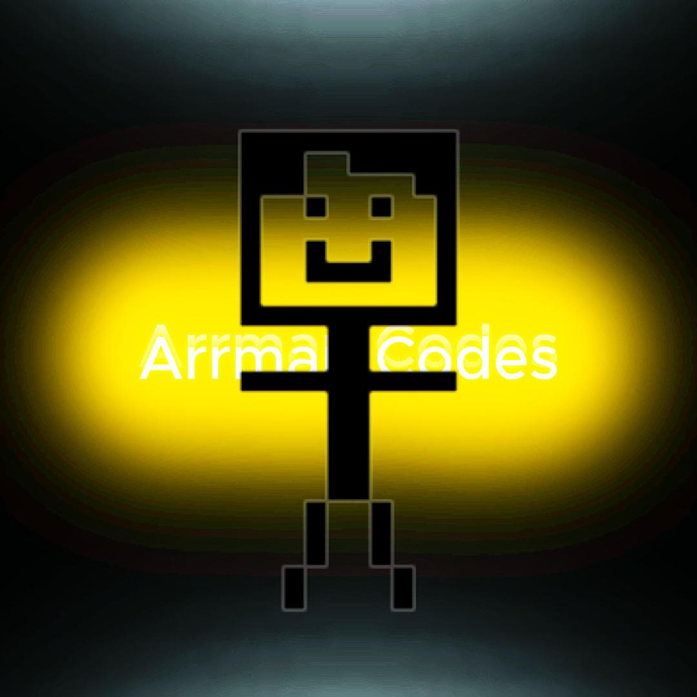
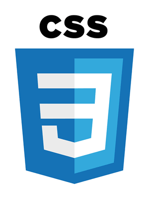
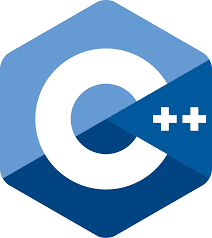
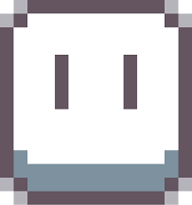
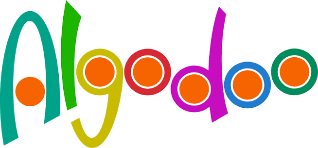
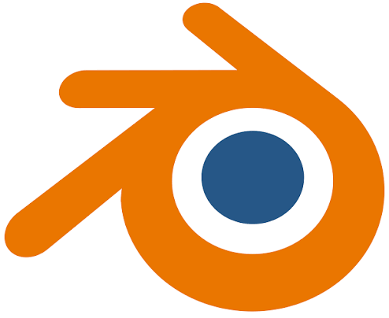

Hey there, I am Arman, a programmer and game dev!

 

My Skills

<ul>
  <li>HTML5, rusty</li>
  

  <li>CSS3, rusty</li>
   
  <li>C, rusty</li>
  
  <li>C++, Game Dev, Intermediate</li>
  
  <li>Pretty good at Pixel art</li>
  
  <li>Been trying to learn Algodoo, @HossainYT007 on youtube showed me this</li>
  
  <li>Blender Beginner, been making a cat shaped pencil case</li>
  
</ul>

 Anyways, I know this looks bad, but it'll improve over time

Statuses: Trying out Algodoo, Making Cat Pencil Case in Blender, Making A GIF weekly in aseprite, Making my own Game Engine

